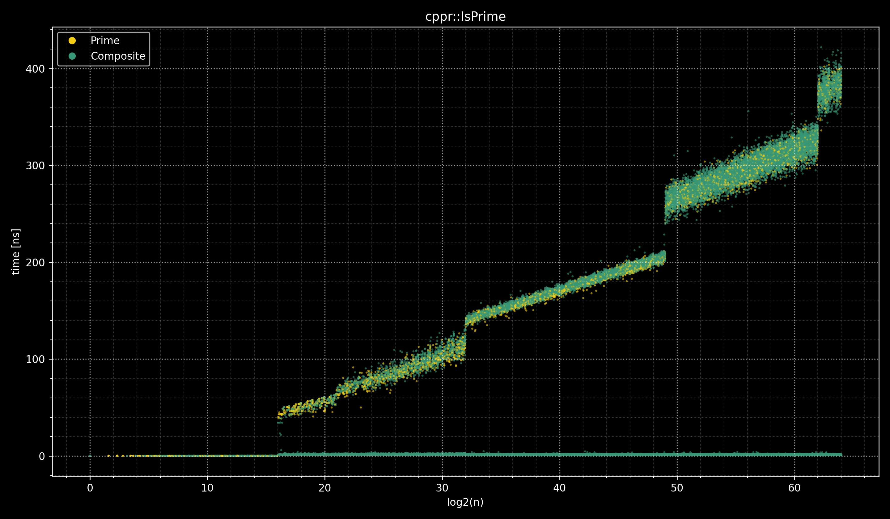
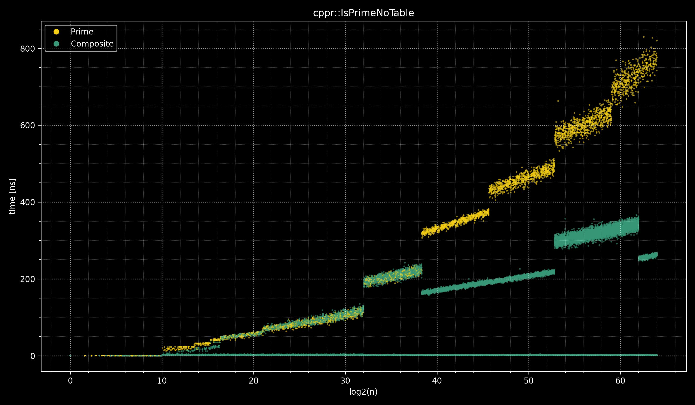
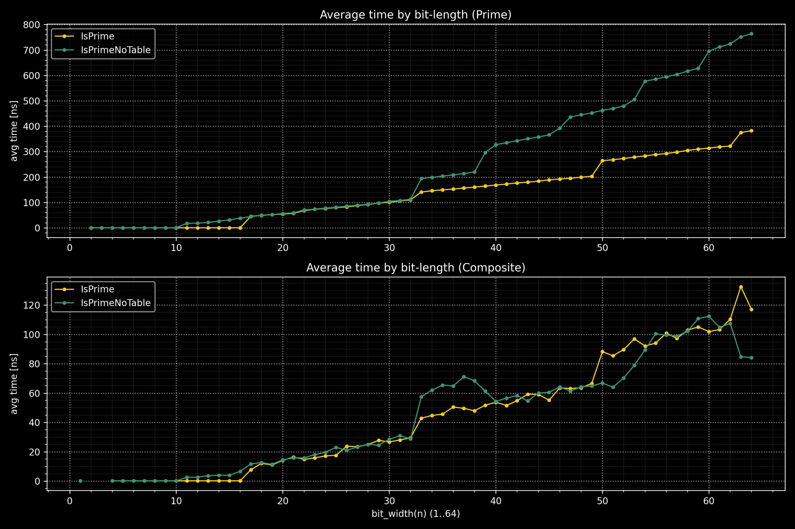

# libcpprime


**libcpprime** is a efficient C++ implementation of a primality test optimized for 64-bit integers.

# Usage

## <libcpprime/IsPrime.hpp>

### `cppr::IsPrime()`

```cpp
namespace cppr {
    bool IsPrime(std::uint64_t n) noexcept; // C++11
    constexpr bool IsPrime(std::uint64_t n) noexcept; // C++20
}
```

It returns true if the input value is a prime number; otherwise, it returns false.

#### example

```cpp
#include <libcpprime/IsPrime.hpp>
#include <cassert>
int main() {
    assert(cppr::IsPrime(998244353) == true);
    assert(cppr::IsPrime(13148563482635885461) == false);
}
```

## <libcpprime/IsPrimeNoTable.hpp>

### `cppr::IsPrimeNoTable`

```cpp
namespace cppr {
    bool IsPrimeNoTable(std::uint64_t n) noexcept; // C++11
    constexpr bool IsPrimeNoTable(std::uint64_t n) noexcept; // C++20
}
```

It returns true if the input value is a prime number; otherwise, it returns false.
If you want to reduce the size of the executable file, use this function instead of `cppr::IsPrime` because `cppr::IsPrime` uses a 36KB table for performance optimization.

#### example

```cpp
#include <libcpprime/IsPrimeNoTable.hpp>
#include <cassert>
int main() {
    assert(cppr::IsPrimeNoTable(998244353) == true);
    assert(cppr::IsPrimeNoTable(1314856348263588546) == false);
}
```

## <libcpprime/FeatureTestMacros.hpp>

### `CPPR_HAS_CONSTEXPR_IS_PRIME`

```cpp
#define CPPR_HAS_CONSTEXPR_IS_PRIME 1 // C++20
```

This is a feature test macro that determines whether `cppr::IsPrime` and `cppr::IsPrimeNoTable` are declared with `constexpr`.

#### example

```cpp
#include <libcpprime/FeatureTestMacros.hpp>
#include <libcpprime/IsPrime.hpp>
#include <iostream>
int main() {
#ifdef CPPR_HAS_CONSTEXPR_IS_PRIME
    constexpr bool x = cppr::IsPrime(1000000007);
#else
    const bool x = cppr::IsPrime(1000000007);
#endif
    std::cout << x << std::endl;
}
```

# Requirements

-   C++11
-   GCC, Clang, GCC (MinGW), Clang (MinGW), MSVC, clang-cl

# Compilation

This library is header-only, so you only need to specify the include path.

```
g++ -I ./libcpprime -O3 Main.cpp
```

# Benchmarks

The benchmark is run on GitHub Actions' Linux with gcc with -O3 optimization enabled.

You can find more detailed benchmark results by clicking [here](https://github.com/Rac75116/libcpprime/actions/workflows/bench.yml?query=branch%3Amain+is%3Acompleted).






# Releases

-   2025/12/21 ver 1.3.0
    - Add `CPPR_HAS_CONSTEXPR_IS_PRIME`
    - Support clang-cl
    - Accelerating Compile-Time Computation
    - Improved compatibility
-   2025/03/10 ver 1.2.11
    -   Change the name on the license
    -   Change Multiprication Algorithm
    -   Replace `__uint128_t` with `unsigned __int128`
-   2025/01/05 ver 1.2.10
    -   Change the condition of `constexpr`
-   2025/01/03 ver 1.2.9
    -   Fix a bug
-   2025/01/02 ver 1.2.8
    -   Improve performance
    -   Suppress warnings
-   2024/12/31 ver 1.2.7
    -   Improve performance
-   2024/12/30 ver 1.2.6
    -   Improve performance
-   2024/12/29 ver 1.2.5
    -   Add copyrights notice
-   2024/12/28 ver 1.2.4
    -   Improve performance
-   2024/12/26 ver 1.2.3
    -   Improve performance
-   2024/12/25 ver 1.2.2
    -   Improve performance
-   2024/12/23 ver 1.2.1
    -   Improve performance
-   2024/12/19 ver 1.2.0
    -   Split `cppr::IsPrime` into `cppr::IsPrime` and `cppr::IsPrimeNoTable`
-   2024/12/19 ver 1.1.2
    -   Fix typo
-   2024/12/18 ver 1.1.1
    -   Add include guards
-   2024/12/18 ver 1.1.0
    -   Add `cppr::IsPrime` with a table
-   2024/12/18 ver 1.0.0
    -   Add `cppr::IsPrime`

# References

- https://miller-rabin.appspot.com/
- https://zenn.dev/mizar/articles/791698ea860581
- https://www.techneon.com/download/is.prime.32.base.data
- https://www.techneon.com/download/is.prime.64.base.data
- https://lemire.me/blog/2016/06/27/a-fast-alternative-to-the-modulo-reduction/
